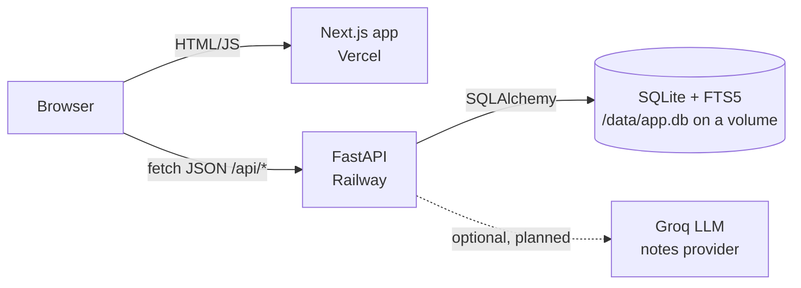
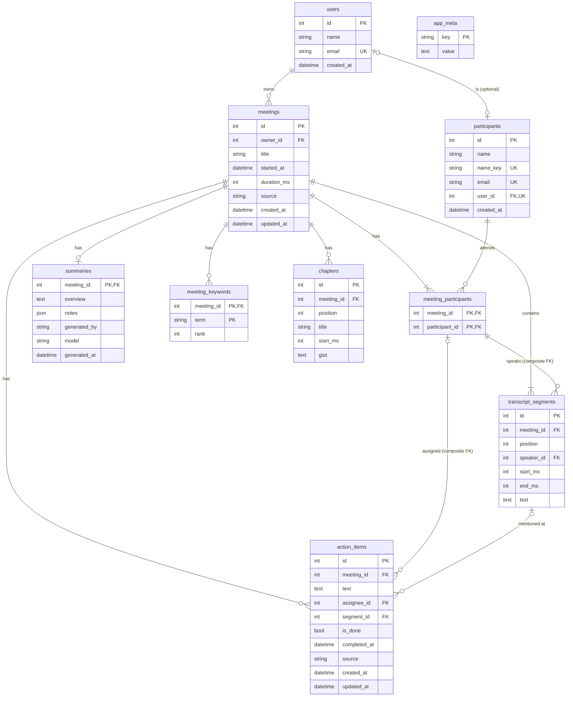

# Fireflies.ai Clone

A functional clone of the logged-in [Fireflies.ai](https://fireflies.ai) meeting workspace, built for the Scaler AI Labs SDE Fullstack assignment. You get a meetings library, an interactive transcript synced to a player, AI-generated notes and action items, and full create, edit and delete, all in a Fireflies-style dark (or light) interface.

- **Live app:** https://fireflies-clone-cyan.vercel.app
- **API:** https://fireflies-clone-backend.up.railway.app (interactive docs at [`/docs`](https://fireflies-clone-backend.up.railway.app/docs))

The live app opens straight into a seeded workspace with eight realistic meetings. There's no login: the brief says to assume a default logged-in user, so you're signed in as the demo user **Jordan Lee**.

> Educational project. Not affiliated with, endorsed by, or connected to Fireflies.ai. The logo is an original mark.

---

## Contents

1. [Features](#features)
2. [Where to find each requirement](#where-to-find-each-requirement)
3. [Tech stack](#tech-stack)
4. [Architecture](#architecture)
5. [Project structure](#project-structure)
6. [Run it locally](#run-it-locally)
7. [Environment variables](#environment-variables)
8. [Seed data](#seed-data)
9. [Database schema](#database-schema)
10. [API overview](#api-overview)
11. [Transcript formats](#transcript-formats)
12. [How the AI notes work](#how-the-ai-notes-work)
13. [Testing](#testing)
14. [Deployment](#deployment)
15. [Assumptions and limitations](#assumptions-and-limitations)
16. [Future work](#future-work)

---

## Features

**Meetings library (`/meetings`)**
- Rows show the title, date, duration, participants and open action items, grouped under day headings.
- Search matches the meeting title, participant names **and transcript text**. Transcript hits show the matching line with the words highlighted and a timestamp that opens the meeting at that moment.
- A Fireflies-style **Filters** pop-over: Participants (any of), Date Range (Today, Last 7 / 14 / 30 days, custom), and Captured From (upload, paste, recorded). Newest / oldest sort.
- Filters live in the URL, so they survive a refresh and work with Back and Forward.
- A channels panel (My Meetings, All Meetings, Uploads) and an AskFred panel, as in Fireflies.

**Meeting page (`/meetings/[id]`)**
- **Transcript** with speaker labels and timestamps.
- A **player** with play/pause, ±15 s, speed and a seek bar. There's no audio (see [Assumptions](#assumptions-and-limitations)), so the player runs a simulated clock over the transcript timeline.
- **Two-way sync:** clicking a line, chapter or action-item timestamp seeks the player. While it plays, the current line is highlighted and auto-scrolled into view; auto-scroll pauses if you scroll manually, and a button resumes it.
- **Transcript search** with every match highlighted, a "3 of 12" count and next/previous.
- **Smart Search** panel, computed from the transcript:
  - filters for Questions, Tasks, Metrics and Date & Time, each narrowing the transcript to its lines;
  - speaker talk time (share and words per minute);
  - topic chips that search the transcript.
- **AI notes:** keywords, overview, bullet notes, an outline of chapters with clickable `(mm:ss)` timestamps, and **action items grouped by person**.
- `?t=<seconds>` deep links open the meeting at a given moment.

**Create, edit, delete**
- **Create** a meeting by uploading a `.txt`, `.vtt` or `.json` transcript, or by pasting text, with a title, date and extra participants. Notes, chapters and action items are generated on import.
- Sample files can be downloaded from the dialog.
- **Edit** the title, date and participants. Removing someone who speaks in the transcript is blocked with a clear message.
- **Delete** a meeting after a confirmation. Everything that belongs to it is removed.
- **Action items:** add, edit text, assign or unassign, complete or reopen, and delete, on the meeting page or on the **Tasks** page (`/tasks`), which gathers items from every meeting (My Tasks / All Tasks, Open / Completed).

**Fireflies experience**
- Icon rail navigation with tooltips.
- A top bar with Ctrl/⌘+K search, Upgrade, notifications and a **Capture ▾** menu.
- Home with Quick Start, Recent, Upcoming and an AI Feed.
- Settings with a working **Light / Dark / System** theme picker. Dark is the default.
- Modals, toasts, loading skeletons, empty and error states, and a 404 page.
- "Coming soon" pages for AskFred, AI Skills, Analytics, Agents, Team and Integrations.
- Responsive down to phone width: the meeting page switches to Notes / Transcript / Insights tabs.

## Where to find each requirement

| Brief requirement | Where to see it |
|---|---|
| Library: title, date, duration, participants; sort by recency | `/meetings` |
| Search and filter by title, date, participant | Top search box (Ctrl+K) and **Filters** on `/meetings` |
| Navbar with profile / settings placeholders | Icon rail (avatar menu at the bottom), `/settings` |
| Transcript with speaker labels and timestamps | Any meeting, **Transcript** tab |
| Player with seek bar | Bottom of any meeting page |
| Click a line to seek, and playback moves the highlight | Click a transcript line, then press play |
| Transcript search with highlighted matches | "Find in transcript" box |
| AI summary, action items, topics / chapters | Centre **Notes** column |
| Create by upload, paste or form | **Capture ▾** → Upload / Paste (or Home → Quick Start) |
| Edit title and participants; delete | Meeting page "…" menu (also the "…" on each library row) |
| Add / edit / complete action items | Meeting page, Action items; or `/tasks` |
| Everything persists | SQLite on a persistent Railway volume (survives redeploys) |
| Toasts, modals, settings placeholders | Throughout; `/settings` |
| Default logged-in user | Jordan Lee (`/api/me`) |

## Tech stack

| Layer | Technology |
|---|---|
| Frontend | Next.js 16 (App Router) + TypeScript, React 19, Tailwind CSS v4, TanStack Query v5, Radix UI (dialog, dropdown, popover, tooltip), sonner (toasts), lucide-react (icons), Vitest |
| Backend | Python 3.13, FastAPI, SQLAlchemy 2, Pydantic 2 + pydantic-settings, Uvicorn, pytest |
| Database | SQLite (WAL mode) with an FTS5 full-text index |
| Hosting | Vercel (frontend), Railway with a persistent volume (backend) |

## Architecture



- The browser calls the API directly. CORS allows only the configured frontend origins.
- **Backend layering:** routers validate input and shape responses; services hold all business logic; models define the schema. Domain errors (not found, conflict, invalid input) are raised in services and mapped to HTTP status codes in one place (`core/errors.py`).
- **The backend is the source of truth** for everything derived: transcript parsing, durations, speakers-as-participants, notes, search and business rules.
- **Frontend:**
  - pages are client components;
  - server state lives in TanStack Query (mutations refresh exactly the data they change, and toggling an action item is optimistic with rollback);
  - filters live in the URL;
  - `lib/api.ts` is the only file that calls `fetch`;
  - every API error becomes a toast from one global handler.
- **Sync design:**
  - `usePlaybackClock` advances the position with `requestAnimationFrame` × playback speed;
  - `findActiveIndex` binary-searches the line whose start time is the latest one ≤ the current time (O(log n) per frame);
  - `useAutoFollow` scrolls that line into view.
- Uvicorn runs one synchronous worker. SQLite has a single writer, so async handlers would add complexity without adding throughput.

## Project structure

```
backend/
  app/
    main.py                 app factory: CORS, routers, error handlers, create tables, seed if empty
    core/                   config (env), database (engine, SQLite pragmas, FTS5), deps (db session, current user), errors
    models/                 SQLAlchemy tables: user, participant, meeting, transcript, notes, action_item, app_meta
    schemas/                Pydantic request/response models
    routers/                meetings, action_items, participants, users, meta (health)
    services/
      transcript_parser.py  .txt / .vtt / .json → normalized segments
      meeting_service.py    create / update / delete meetings in one transaction
      search_service.py     library query: filters, FTS5, snippets, pagination
      action_item_service.py
      notes/                rules.py (deterministic notes), llm.py (provider interface), generate_notes()
    seed/                   seed.py + data/ (meetings.json and one .txt transcript per meeting)
  tests/                    pytest suite (83 tests)
  requirements.txt · .python-version · .env.example
frontend/
  src/
    app/                    routes: / (Home), /meetings, /meetings/[id], /tasks, /settings, coming-soon pages
    components/
      layout/               AppShell, IconRail, Topbar, CaptureButton, ProfileMenu, BrandMark
      meetings/             library, filters pop-over, channels, create/edit/delete dialogs
      meeting-detail/       top bar, Smart Search, notes, transcript, action items, player
      home/ · tasks/ · settings/ · askfred/ · ui/ (Button, Dialog, Tabs, Tooltip, Avatar, ...)
    hooks/                  usePlaybackClock, useAutoFollow, useTranscriptSearch, useTheme, useMediaQuery, ...
    lib/                    api.ts, queries.ts, types.ts, filters.ts, smartSearch.ts, format.ts, theme.ts (+ tests)
  public/samples/           sample transcripts (standup.txt, design-review.vtt, customer-call.json)
docs/                       design specs and implementation plans
```

## Run it locally

Prerequisites: **Python 3.13** and **Node.js 20+**. The backend runs on port 8000 and the frontend on port 3000.

### Backend

**Windows (PowerShell)**
```powershell
cd backend
py -3.13 -m venv .venv
.venv\Scripts\python -m pip install -r requirements.txt
Copy-Item .env.example .env
.venv\Scripts\python -m pytest
.venv\Scripts\python -m uvicorn app.main:create_app --factory --port 8000
```

**macOS / Linux**
```bash
cd backend
python3.13 -m venv .venv
.venv/bin/python -m pip install -r requirements.txt
cp .env.example .env
.venv/bin/python -m pytest
.venv/bin/python -m uvicorn app.main:create_app --factory --port 8000
```

- On first start the database is created at `backend/data/app.db` and seeded with eight meetings.
- Check it at http://localhost:8000/api/health; the API docs are at http://localhost:8000/docs.
- To wipe the database and reseed it: `python -m app.seed --reset`, run with the venv's Python from `backend/`.
- On Windows, `uvicorn --reload` can hang. Run without `--reload` and restart after backend changes.

### Frontend

```bash
cd frontend
npm ci
cp .env.example .env.local        # Windows PowerShell: Copy-Item .env.example .env.local
npm run dev
```

Open http://localhost:3000. Other scripts: `npm run lint`, `npm run typecheck`, `npm test`, `npm run build`.

## Environment variables

**Backend** (`backend/.env`; see `.env.example`)

| Variable | Default | Purpose |
|---|---|---|
| `DATABASE_URL` | `sqlite:///./data/app.db` | SQLite file. Production: `sqlite:////data/app.db` (on the volume) |
| `CORS_ORIGINS` | `http://localhost:3000` | Comma-separated frontend origins allowed to call the API |
| `SEED_ON_STARTUP` | `true` | Seed the demo data on first start (skipped once seeded) |
| `LLM_PROVIDER` | `none` | Notes provider. `none` uses the rules generator (see [AI notes](#how-the-ai-notes-work)) |
| `GROQ_API_KEY` | empty | Reserved for the planned Groq provider; never sent to the browser |
| `LLM_MODEL` | empty | Model name for the LLM provider |
| `LLM_TIMEOUT_SECONDS` | `20` | LLM request timeout |
| `MAX_UPLOAD_BYTES` | `1000000` | Largest transcript accepted (1 MB) |
| `DEFAULT_PAGE_SIZE` | `20` | Library page size |

**Frontend** (`frontend/.env.local`; see `.env.example`)

| Variable | Example | Purpose |
|---|---|---|
| `NEXT_PUBLIC_API_BASE_URL` | `http://localhost:8000` | Backend base URL (no trailing slash) |

Secrets live only in environment variables. `.env*` files and database files are git-ignored.

## Seed data

- **One demo user:** Jordan Lee (`jordan@orbitlabs.example`).
- **People:** nine fictional people across a product team and two external contacts.
- **Eight meetings**, each with an original transcript of 40–60 lines, hand-written notes, and 3–6 action items (some already done):

| # | Meeting | When | Length |
|---|---|---|---|
| 1 | Weekly Product Sync | today | ~31 min |
| 2 | Discovery Call: Brightline Logistics | 1 day ago | ~40 min |
| 3 | Sprint 18 Planning | 3 days ago | ~45 min |
| 4 | Onboarding Flow Design Review | 6 days ago | ~35 min |
| 5 | 1:1 Jordan / Priya | 9 days ago | ~20 min |
| 6 | Pricing Page Experiment Readout | 13 days ago | ~26 min |
| 7 | Customer Escalations Triage | 20 days ago | ~19 min |
| 8 | Q4 Roadmap Review | 33 days ago | ~51 min |

- Dates are relative to when the database is first seeded, so the library always looks current.
- Every filter preset and every person returns at least one meeting.
- "pricing" appears in five meetings, to demo transcript search.
- Two meetings are marked as uploads, so the Uploads view has content.
- Seed transcripts are imported through the **same parser as user uploads**.
- The seed runs once: an `app_meta.seeded_at` row marks it done.

## Database schema



**Constraints and indexes**
- `meetings`:
  - `CHECK duration_ms >= 0`;
  - `CHECK source IN (seed, upload, paste)`;
  - `INDEX (owner_id, started_at)`.
- `transcript_segments`:
  - `UNIQUE (meeting_id, position)`;
  - `INDEX (meeting_id, start_ms)`;
  - `CHECK start_ms >= 0`;
  - `CHECK end_ms >= start_ms`.
- `action_items`:
  - `CHECK source IN (ai, user)`;
  - `CHECK is_done = (completed_at IS NOT NULL)`.
- `segments_fts`: an FTS5 table over transcript text (external content), kept in sync by insert, update and delete triggers.
- SQLite pragmas set on every connection: `foreign_keys=ON`, `journal_mode=WAL`, `busy_timeout=5000`, `synchronous=NORMAL`.

**Why the schema looks like this**

| Decision | Reason |
|---|---|
| People (`participants`) are separate from meetings, linked many-to-many | The same person attends many meetings. Filtering by person is one indexed lookup, and renaming a person updates every transcript |
| Composite FK: segment speaker → `meeting_participants(meeting_id, participant_id)` | The database itself guarantees every speaker belongs to *that* meeting. Removing a speaker fails at the database level; the service checks first and returns a friendly 409 |
| Composite FK: action item assignee → `meeting_participants` | An action item can only be assigned to someone who was in the meeting. NULL means unassigned. Removing a participant clears their assignments in the same transaction |
| Composite FKs use NO ACTION, not RESTRICT | Deleting a meeting cascades to its participants and segments in one statement. NO ACTION is checked at the end of the statement, so the cascade succeeds; RESTRICT would fail partway through |
| `duration_ms` stored on `meetings` | Transcripts are immutable after import, so it's written once and never drifts, and every list query saves an aggregate |
| Open action-item count computed in the query | It changes whenever an item is completed; computing it keeps it consistent |
| Chapter end times not stored | Derived from the next chapter's start, or the meeting's duration |
| Times as integer milliseconds | No float rounding; exact comparisons for seek and sync |
| `summaries` is a 1:1 table with provenance (`generated_by`, `model`, `generated_at`) | Notes can be regenerated or come from different sources, and the UI shows where they came from. Bullet notes are a JSON list because they're always read and written as a whole |
| Keywords as rows with a composite PK | No duplicate terms per meeting, and filtering by topic is indexable |
| Completion as state (`is_done` + `completed_at`, tied by a CHECK) | Done items keep their history, and the two columns can't contradict each other |
| FTS5 external-content table + triggers | Fast ranked full-text search across all transcripts without duplicating text; triggers keep it in sync, including on cascade deletes |
| ORM relationships use `passive_deletes=True` | One `DELETE FROM meetings` lets the database cascade, instead of the ORM loading and deleting every child row |

## API overview

All routes are under `/api`. Interactive docs are at `/docs`. Errors use `{"detail": "<message>"}` with these codes:
- 404: not found, or owned by another user;
- 409: rule conflict;
- 413: upload too large;
- 415: unsupported file type;
- 422: invalid input or an unparseable transcript (the message names the line);
- 401: unknown user.

| Method | Path | Request | Response |
|---|---|---|---|
| GET | `/api/health` | — | `{status, database, fts5, llm_provider, boot_count}` |
| GET | `/api/me` | — | The current user |
| GET | `/api/meetings` | `q`, `participant_id` (repeatable, any of), `date_from` (inclusive), `date_to` (exclusive), `source` (repeatable), `sort=newest\|oldest`, `limit` (1–100), `offset` | `{items, total, limit, offset}`. Each item has `match: {segment_id, start_ms, text}` when `q` matched transcript text |
| POST | `/api/meetings` | JSON `{title, started_at?, transcript, format?: auto\|txt\|vtt\|json, participants?}` | 201, the full meeting |
| POST | `/api/meetings/import` | multipart `file` (.txt/.vtt/.json ≤ 1 MB), `title?`, `started_at?`, `participants?` (comma-separated) | 201, the full meeting |
| GET | `/api/meetings/{id}` | — | The meeting with participants, segments, summary, keywords, chapters and action items |
| PATCH | `/api/meetings/{id}` | `{title?, started_at?, participants?}`. Omitted fields are untouched; `participants` replaces the set | 200; 409 if a speaker would be removed |
| DELETE | `/api/meetings/{id}` | — | 204; cascades to everything the meeting owns |
| GET | `/api/participants` | `q?` | People in your meetings, with meeting counts |
| GET | `/api/action-items` | `scope=mine\|all`, `status=open\|done\|all` | `{items}`: action items across all meetings, with meeting title, date and assignee name (the Tasks page) |
| POST | `/api/meetings/{id}/action-items` | `{text, assignee_id?}` | 201; 422 if the assignee isn't in the meeting |
| PATCH | `/api/action-items/{id}` | `{text?, assignee_id?, is_done?}`. An explicit `null` assignee unassigns; an omitted field is untouched | 200 |
| DELETE | `/api/action-items/{id}` | — | 204 |

**Mock auth.** The `X-User-Id` header selects the user; without it, the demo user is used. Every query is scoped to the current user's meetings, so another user's meeting or action item returns 404, and its existence isn't revealed.

## Transcript formats

Upload and paste use the same parser. The format is detected automatically: text starting with `WEBVTT` is VTT, text that parses as JSON is JSON, and anything else is TXT.

**TXT**: one line per speaker turn. Timestamps are optional (`[HH:MM:SS]`, `[MM:SS]`, brackets optional). A line without a speaker continues the previous turn.
```
[00:00] Priya Nair: Welcome everyone, let's get started.
[00:12] Marcus Chen: Thanks. First item is the pricing page.
```
If no line has a timestamp, timings are estimated at 150 words per minute. Mixing timed and untimed lines is rejected with the line number.

**VTT**: standard WebVTT cues. The speaker comes from `<v Name>` or a `Name:` prefix.
```
WEBVTT

00:00:00.000 --> 00:00:04.000
<v Priya Nair>Welcome everyone.
```

**JSON**: an array, or `{"segments": [...]}`, of `{speaker, text, start?, end?}`. Times are seconds, `"MM:SS"` or `"HH:MM:SS"`.
```json
[{ "speaker": "Priya Nair", "text": "Welcome everyone.", "start": 0 }]
```

**Normalisation and limits**
- Whitespace is collapsed, empty text dropped, and lines stable-sorted by start time.
- A segment's end is the given end, else the next line's start.
- Limits:
  - ≤ 1 MB;
  - ≤ 5,000 lines;
  - ≤ 50 speakers;
  - names ≤ 80 characters;
  - UTF-8 (a BOM is stripped).
- Speakers are matched to existing people by normalised name and added to the meeting.

## How the AI notes work

Notes are generated when a meeting is created, inside the same database transaction as the meeting.

- **Rules generator (what runs today):** deterministic, pure Python, no network (`services/notes/rules.py`).
  - **Keywords:** frequent terms after removing stopwords; repeated two-word phrases score higher.
  - **Overview and notes:** the best-scoring sentences, kept in chronological order.
  - **Chapters:** the meeting is split into equal time windows snapped to line starts, each titled by its top keywords.
  - **Action items:** commitment and request phrases ("I'll…", "can you…", "let's…", "by Friday…"). The assignee is the speaker for "I'll", or the person addressed by name ("Priya, can you…").
- **Provider interface:** `generate_notes()` accepts an optional LLM provider and falls back to the rules generator on *any* provider failure (network, timeout, invalid JSON, schema mismatch). The fallback is covered by tests. A Groq provider is planned (see [Future work](#future-work)); with `LLM_PROVIDER=none`, the rules generator is used.
- **Seeded meetings** have hand-written notes. The notes panel shows where notes came from ("generated from the transcript" or "by {model}").
- **Smart Search** counts (questions, tasks, metrics, dates, talk time) are computed in the browser from the transcript by pure, unit-tested functions (`frontend/src/lib/smartSearch.ts`).

## Testing

**Backend** (83 tests): `cd backend` then `python -m pytest`, using the venv's Python. Each test gets a fresh temporary SQLite database. The suite covers:
- the transcript parser: every format, timestamp variants, estimation, errors and limits;
- the rules notes generator: determinism, chapters, action-item and assignee detection;
- meetings: create by paste and import, 413 and 415 errors, PATCH semantics, removing a speaker → 409, delete cascades including the FTS index;
- search: title, participant and transcript matches; special characters never causing a 500; filters and pagination;
- action items, and the Tasks list with scope, status and ownership;
- schema constraints, mock auth and ownership (404 for other users), LLM fallback, seed idempotency, health and CORS.

**Frontend** (30 tests): `cd frontend` then `npm test`. They cover:
- URL filter parsing and API mapping;
- time formatting;
- highlight ranges;
- the sync binary search;
- Smart Search matchers and talk time;
- action-item grouping;
- theme resolution.

Every change is also checked with `npm run lint`, `npm run typecheck` and `npm run build`, and clicked through in a browser.

## Deployment

**Backend on Railway.** Configured in the Railway dashboard; config-as-code isn't used.
- Source: this repo, **root directory `backend`**. Python 3.13 comes from `backend/.python-version`.
- **Start command:** `uvicorn app.main:create_app --factory --host 0.0.0.0 --port $PORT`
- **Healthcheck path:** `/api/health`
- **Volume** mounted at `/data`.
- **Variables:**
  - `DATABASE_URL=sqlite:////data/app.db`;
  - `CORS_ORIGINS=https://fireflies-clone-cyan.vercel.app,http://localhost:3000`;
  - optionally `LLM_PROVIDER` and `GROQ_API_KEY`.
- A public domain is generated for the service.
- **Persistence:** the database file lives on the volume, so data survives redeploys. `/api/health` reports a `boot_count` that goes up on every start, which makes this easy to verify.

**Frontend on Vercel**
- Root directory `frontend`, framework Next.js.
- Environment variable `NEXT_PUBLIC_API_BASE_URL=https://fireflies-clone-backend.up.railway.app`.

## Assumptions and limitations

- **Authentication is mocked**, as the brief allows. There's one demo workspace and the `X-User-Id` header selects the user. Ownership checks are still enforced in every query, so the model is ready for real auth.
- **No audio or speech-to-text** (out of scope). The player runs a simulated clock over the transcript timeline, and the page says so.
- **People are identified by normalised display name**, because transcripts carry names, not emails. The `email` column is where real identity would go.
- **Transcripts are immutable after import.** Title, date, participants and action items are editable.
- **Notes come from the rules generator**, which is deterministic and fast but less fluent than an LLM. Seeded meetings have hand-written notes.
- **Concurrency:** one worker, SQLite WAL and a busy timeout. With concurrent edits, the last write wins.
- **Placeholders** ("coming soon"): AskFred answers, AI Skills, Analytics, Agents / live notetaker, Team and sharing, Integrations, channels, calendar scheduling and billing.
- **Sentiment is not shown** in Smart Search: a keyword-list score would be misleading.
- **Schema changes** are applied by recreating the database; there's no migration tooling.

## Future work

- Groq-generated notes, with the rules generator as fallback: a JSON-only prompt that treats the transcript as untrusted data, validated output, and assignees and timestamps mapped back to real transcript lines.
- Export notes and transcript as Markdown or text.
- Player keyboard shortcuts (Space, ←/→, `/` for search).
- AskFred: questions answered from the meeting's transcript.
- Comments, highlights and soundbites on transcript lines; sharing and teams.
- Real authentication and multi-user workspaces; Postgres and migrations if it outgrows SQLite.
